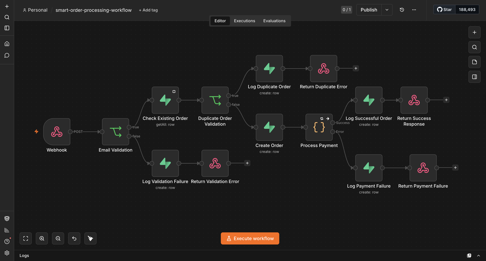
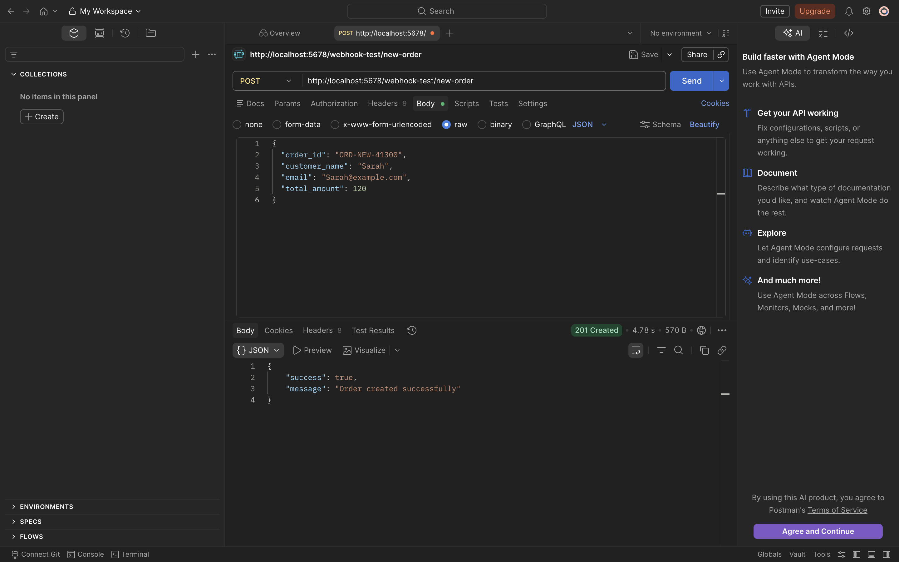
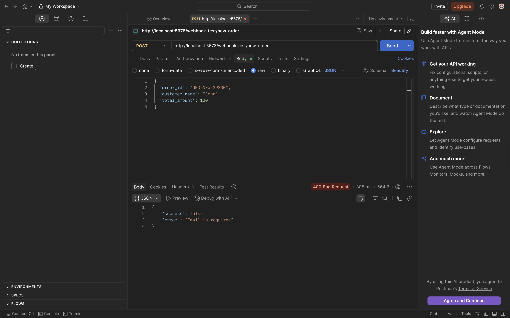
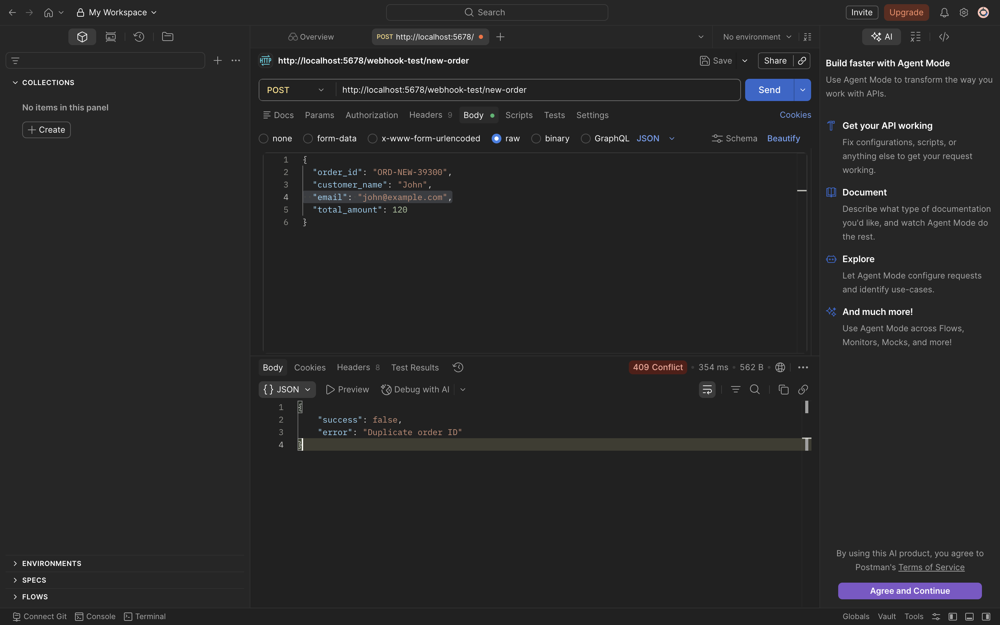
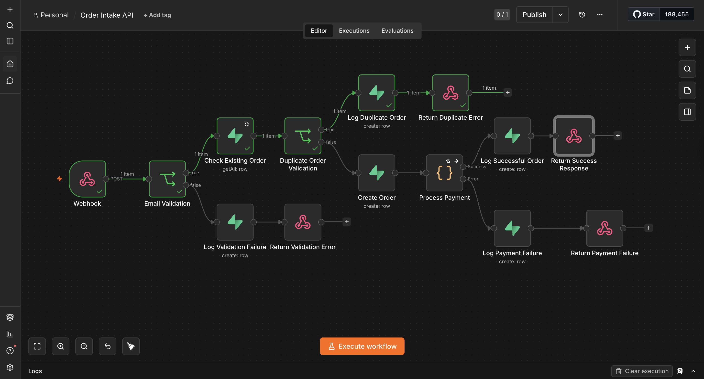
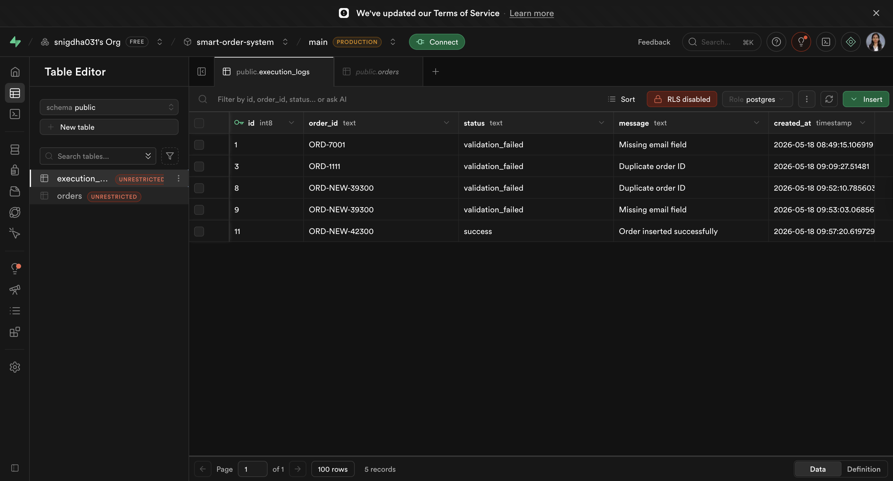

# 🚀 Smart Order Processing System

A fault-tolerant order processing workflow built using n8n and Supabase.

This project simulates a production-style backend automation system capable of handling validation, duplicate prevention, payment processing retries, execution monitoring, and failure recovery.

## 📌 Project Overview

Modern order systems must be resilient against:
*   Invalid requests
*   Duplicate order submissions
*   Flaky external APIs
*   Temporary payment failures
*   Inconsistent execution states

This workflow demonstrates how backend reliability concepts can be implemented visually using n8n.
The system receives incoming orders through a webhook API, validates them, checks for duplicates, processes payments with retry handling, logs workflow events, and returns structured API responses.

## 🧠 Key Engineering Concepts Implemented

### ✅ API-Based Order Intake
*   Webhook endpoint using n8n
*   POST request handling
*   Structured JSON payload processing

### ✅ Validation Layer
*   Required field validation
*   Email validation gate
*   Controlled API error responses

### ✅ Duplicate Order Prevention
*   Database lookup before insert
*   Idempotency protection
*   HTTP 409 Conflict responses

### ✅ Payment Processing Simulation
*   Simulated flaky payment gateway
*   Randomized API failure behavior
*   External dependency modeling

### ✅ Retry Handling
*   Automatic retries for payment failures
*   Retry delay configuration
*   Recovery from transient failures

### ✅ Execution Monitoring & Audit Logging
*   Success logging
*   Validation failure logging
*   Duplicate request logging
*   Payment failure logging
*   Centralized execution tracking table

### ✅ Production-Style API Responses
*   **HTTP 201** → Order Created
*   **HTTP 400** → Validation Failure
*   **HTTP 409** → Duplicate Order
*   **HTTP 500** → Payment Failure

## 🏗️ Workflow Architecture

```text
Webhook API
   ↓
Email Validation
   ↓
Duplicate Order Detection
   ↓
Create Order
   ↓
Process Payment
   ↓
Retry Handling
   ↓
Execution Logging
   ↓
API Response
```

## ⚙️ Tech Stack

| Technology | Purpose |
| :--- | :--- |
| **n8n** | Workflow orchestration |
| **Supabase** | PostgreSQL database backend |
| **Docker** | Local n8n deployment |
| **Postman** | API testing |
| **JavaScript** | Payment simulation logic |

---

🗂️ Project Structure
smart-order-system/
│
├── README.md
├── workflows/
│   └── smart-order-processing-workflow.json
│
├── docs/
│   ├── architecture.md
│   ├── api-testing.md
│   └── retry-handling.md
│
├── screenshots/
│   ├── workflow-overview.png
│   ├── api-success-response-201.png
│   ├── api-validation-error-400.png
│   ├── api-duplicate-error-409.png
│   ├── execution-logs-table.png
│   ├── orders-table.png
│   ├── workflow-success-logging.png
│   ├── workflow-validation-failure.png
│   └── workflow-duplicate-detection.png


🔄 Workflow Scenarios
✅ Successful Order Processing
Order received through webhook

Validation passes

Duplicate check passes

Order inserted into database

Payment succeeds

Success logged

HTTP 201 response returned

❌ Validation Failure Scenario
If required fields are missing:

Workflow stops early

Validation failure logged

HTTP 400 returned

Example response:

JSON
{
  "success": false,
  "error": "Email is required"
}
❌ Duplicate Order Scenario
If order already exists:

Duplicate detected before insert

Duplicate event logged

HTTP 409 returned

Example response:

JSON
{
  "success": false,
  "error": "Duplicate order ID"
}
❌ Payment Failure Scenario
If payment gateway fails:

Retries triggered automatically

Workflow attempts recovery

Payment failure logged

HTTP 500 returned after retry exhaustion

Example response:

JSON
{
  "success": false,
  "error": "Payment processing failed"
}

## 📊 Database Tables

### `orders`
Stores successfully created orders.

| Column | Purpose |
| :--- | :--- |
| `order_id` | Unique order identifier |
| `customer_name` | Customer name |
| `email` | Customer email |
| `total_amount` | Order amount |
| `status` | Order status |
| `created_at` | Timestamp |

### `execution_logs`
Tracks workflow execution events.

| Column | Purpose |
| :--- | :--- |
| `order_id` | Related order |
| `status` | success / duplicate / validation_failed / payment_failed |
| `message` | Execution details |
| `created_at` | Timestamp |

## 📸 Screenshots

**Workflow Overview**


**Successful API Response (201)**


**Validation Failure (400)**


**Duplicate Order Error (409)**


**Duplicate Order Detection Workflow**


**Execution Logs Table**


## 🧪 Example API Request
JSON
{
  "order_id": "ORD-1001",
  "customer_name": "John Doe",
  "email": "john@example.com",
  "total_amount": 120
}

## 🔥 Engineering Highlights
This project focuses heavily on backend workflow reliability concepts rather than simple automation.

Key backend engineering patterns implemented:

Validation gates

Idempotency protection

Retry handling

Failure recovery

Execution observability

Structured API responses

Workflow resilience

Audit logging

## 🚀 Future Improvements
Potential future enhancements:

Inventory management integration

AI-based fraud detection

Slack/Discord notifications

Dead-letter queue implementation

Grafana monitoring dashboard

Rate limiting

Authentication & authorization

Payment provider integration (Stripe)

## 👩‍💻 Author
Built by Snigdha Raghavan as a workflow engineering and backend automation project using n8n and Supabase.